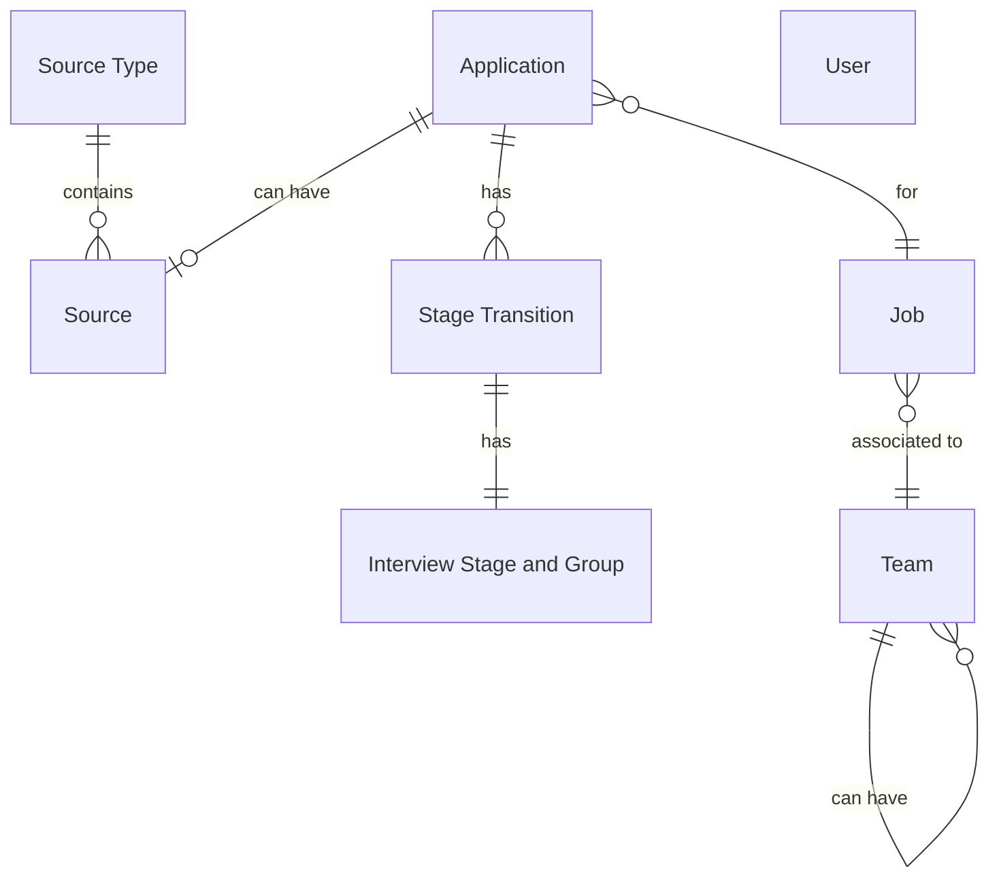

This repository contains the take home assignment for Ashby's take home assignment.

# Table of Contents
## [Prerequiste](#prerequiste-)
## [Design Decisions](#design-decisions-)
## [Pipeline Setup](#pipeline-setup-)
## [Data Quality Tests](#data-quality-tests-)
## [Data Visualization](#data-visualization-)
## [Closing Comments](#closing-comments-)

# Prerequiste [↑](#table-of-contents)

## Datasets
Datasets were downloaded from the instructions for the Ashby assignment [here](https://ashbyhq.notion.site/Take-Home-Assignment-Data-Modeling-Analysis-0997f76f1f384da09bd6013b41cbc993#22e8674f1a0342829143bf8380422414).

## Tools
Below are the tools used for the Ashby assignment:
```
Visual Studio Code (https://code.visualstudio.com/)
Python v3.10.14 (https://www.python.org/downloads/)
DuckDB (https://duckdb.org/)
Docker (https://www.docker.com/)
```

The following are the Python packages required to enable the data pipeline. These Python packages can be installed by pip:
```
dbt-core
dbt-duckdb
setuptools
```

# Design Decisions [↑](#table-of-contents)

## Outline
I went through each of the data sources to organize and understand the relationship between the different sources. At a quick glance, these sources appeared to be grouped as below:

Data Sources & Their Relationship


In the chart above, it shows that a single `Source Type` maps to 0 or more `Sources`, an `Application` has 0 or 1 `Source`, 0 or more `Applications` are part of a `Job`, a `Team` is associated to 0 or more `Job`, a `Team` can have 0 or more `Teams` under itself, an `Application` has 0 or more `Stage Transitions`, and a Stage Transition has a 1 to 1 relationship with `Interview Stage and Group`. `Users` does not map to any other data source.

## Database Choice
Duckdb was picked as the database to hold all the data and to run the dbt models against. While a cloud database could have made sense (to mimic the actual production environment in Ashby), for this specific assignment a full cloud instance is overkill for this project. Since this is also a self contained project, not having to connect to the cloud would speed up model development, and any potential run time issues would not make a costly error. Since everything is hosted locally as well, security would not be a big concern either.

## Visualization Choice
Picking duckdb as the database however, did come with some drawbacks. A big issue being that not a lot of BI tools support it. With limited online documentation and a limited duration, I opted to use an existing resource that had Superset and duckdb setup already (`superset-readme.md` and `LICENSE` are from the owner's repository). Modifications were made to strip out the excess and only keep the necessary files to run Superset.

# Pipeline Setup [↑](#table-of-contents)

## Insert Data Into Database
> **NOTE:** This step is not required but can be followed to reinsert the raw data into the database. Otherwise, this step can be ignored.

Navigate to `ashby/database` in a terminal and run the following command
```
duckdb ashby.db
```

Copy and paste the following commands within the duckdb CLI. This will create the respective tables for all the data downloaded.
```
CREATE OR REPLACE TABLE applications AS SELECT * FROM '../raw_data/2024 - Data Take Home - Applications.csv';
CREATE OR REPLACE TABLE interview_stages_and_groups AS SELECT * FROM '../raw_data/2024 - Data Take Home - Interview Stages and Groups.csv';
CREATE OR REPLACE TABLE jobs AS SELECT * FROM '../raw_data/2024 - Data Take Home - Jobs.csv';
CREATE OR REPLACE TABLE source_types AS SELECT * FROM '../raw_data/2024 - Data Take Home - Source Types.csv';
CREATE OR REPLACE TABLE sources AS SELECT * FROM '../raw_data/2024 - Data Take Home - Sources.csv';
CREATE OR REPLACE TABLE stage_transitions AS SELECT * FROM '../raw_data/2024 - Data Take Home - Stage Transitions.csv';
CREATE OR REPLACE TABLE teams AS SELECT * FROM '../raw_data/2024 - Data Take Home - Teams.csv';
CREATE OR REPLACE TABLE users AS SELECT * FROM '../raw_data/2024 - Data Take Home - Users.csv';
.quit
```

## Update dbt
> **NOTE:** This step can be ignored if running dbt is not required.

Copy `dbt/profiles.yml` where dbt profiles should exist (on MacOS, this is usually `~/.dbt/profiles.yml`).

Run the following dbt commands to verify the duckdb connector and to install the dbt packages:
```
dbt debug
dbt deps
```


## Initialize Superset
> **NOTE:** Docker is used to install Apache Superset. Running docker commands requires the user to create and be logged into Docker.

> **NOTE:** Superset user and password can be adjusted as needed in `.env`.

Navigate to the root directory and run the below command:

```
docker compose up --build
```

Once the image is ready, navigate to http://localhost:8088 to login to Superset using the admin user and passwords listed in `.env`.

> **NOTE:** Newly created dashboards will not save if created by the UI. To persist the dashboards, select all dashboards on the dashboard list and export them, rename the zip file to `dashboard.zip`, and replace the file in `ashby/superset/assets`.

# Data Quality Tests [↑](#table-of-contents)
The tests that have been initialized for the models are primarily related to the uniqueness (for primary keys), accepted values (for status and types), and non null values (for required fields).

For `stg_applications`, even though the assignment prompt states that an application can only be `archived`, `hired`, or `active`, `lead` is added as a potential accepted value to prevent an issue with the dbt tests. A follow up to this assignment could be to look into whether the assignment prompt was incorrect or the data is incorrect.

# Data Visualization [↑](#table-of-contents)
To run the data visualization tool Superset, Docker will need to be installed. Once installed, navigate to the root directory and run the command `docker compose up --build`. Any newly created dashboards and charts must be exported, or will be removed on the docker image closing and will not be available when the image runs subsequent times.

# Closing Comments [↑](#table-of-contents)
The immediate next step for this project would be to incorporate more automated testing tools as part of the CI/CD workflow to handle data quality tests. While dbt tests can be useful, they are relatively basic data governance tools.

Afterwards,it would be to expand on the documentation for the dbt models and setting up the workflow to automate the dbt documentation on the visualization datasets/charts.

Another low priority project would be to automate setting up the work environment, as roughly 50% of the time spent for this project was actually related to getting the environment setup correctly.
