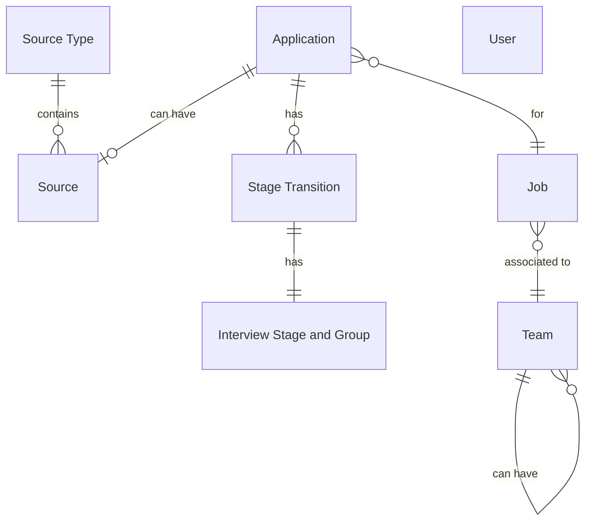

This repository contains the take home assignment for Ashby's take home assignment.

# Table of Contents

## [Prerequiste](#prerequiste-)

## [Pipeline Setup](#pipeline-setup-)

## [Data Quality Tests](#data-quality-tests-)

## [Data Visualization](#data-visualization-)

## [Design Decisions](#design-decisions-)

## [Closing Comments](#closing-comments-)

# Prerequiste [↑](#table-of-contents)

## Datasets
Datasets were downloaded from the instructions for the Ashby assignment [here](https://ashbyhq.notion.site/Take-Home-Assignment-Data-Modeling-Analysis-0997f76f1f384da09bd6013b41cbc993#22e8674f1a0342829143bf8380422414).

## Tools
Below are the tools used for the Ashby assignment:
```
Visual Studio Code (https://code.visualstudio.com/)
Python v3.10.14 (https://www.python.org/downloads/)
DuckDB (https://duckdb.org/)
Docker (https://www.docker.com/)
```

The following are the Python packages required to enable the data pipeline. These Python packages can be installed by pip:
```
dbt-core
dbt-duckdb
jupyterlab
setuptools
```

## Installation
> **NOTE:** Docker is to install Apache Superset. Ignore this step if the visualization tool is not required.

Once the above tools and packages are installed, initialize Superset by cloning the Superset repository via `git clone https://github.com/apache/superset.git` into a directory. Then, navigate into the superset directory in terminal, and run the following command to start up Superset:

docker compose -f docker-compose-non-dev.yml up

## Brainstorm
Once all dbt models are organized, I proceeded to go through each of the data sources to organize and understand the relationship between the different sources. At a quick glance, these sources appeared to be grouped as below:

Data Sources & Their Relationship

Legend:
    || refers to exactly one
    }| or |{ refers to one or more
    |o or o| refers to zero or one
    }o or o{ refers to zero or more

    Many sources belong to a source type, but a source can't have multiple sources.
    id4[Applications]<-->id6[sources];


# Pipeline Setup [↑](#table-of-contents)

Navigate to `ashby/database` in a terminal and run the following command
```
duckdb ashby.db
```

Then copy and paste the following commands within the duckdb CLI. This will create the respective tables for all the data downloaded.
```
CREATE TABLE applications AS SELECT * FROM '../raw_data/2024 - Data Take Home - Applications.csv';
CREATE TABLE interview_stages_and_groups AS SELECT * FROM '../raw_data/2024 - Data Take Home - Interview Stages and Groups.csv';
CREATE TABLE jobs AS SELECT * FROM '../raw_data/2024 - Data Take Home - Jobs.csv';
CREATE TABLE source_types AS SELECT * FROM '../raw_data/2024 - Data Take Home - Source Types.csv';
CREATE TABLE sources AS SELECT * FROM '../raw_data/2024 - Data Take Home - Sources.csv';
CREATE TABLE stage_transitions AS SELECT * FROM '../raw_data/2024 - Data Take Home - Stage Transitions.csv';
CREATE TABLE teams AS SELECT * FROM '../raw_data/2024 - Data Take Home - Teams.csv';
CREATE TABLE users AS SELECT * FROM '../raw_data/2024 - Data Take Home - Users.csv';
.quit
```

Copy `profiles.yml` where dbt profiles should exist (on MacOS, this is usually `~/.dbt/profiles.yml`).


### Database


# Data Quality Tests [↑](#table-of-contents)

# Data Visualization [↑](#table-of-contents)

# Design Decision [↑](#table-of-contents)
Once the initial infrastructure was set (inserting the data into duckDB and building the staging dbt models), I started diving deeper into the questions that this take home assignment was meant to answer to build the downstream models and the visualizations.

# Closing Comments [↑](#table-of-contents)
To create a python script to read the raw data and create the duckdb database. Unfortunately there were some issues that were preventing me from proceeding and was taking too much time to resolve. 

2024-07-30: 10-1:18 - install setup sans visualization
2024-07-30: 4-5     - visualization setup
2024-07-31: 2-5     - visualization setup..
2024-07-31: 7:15-11 - model setup